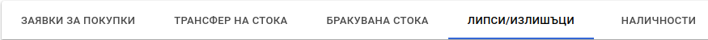
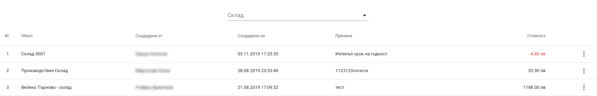
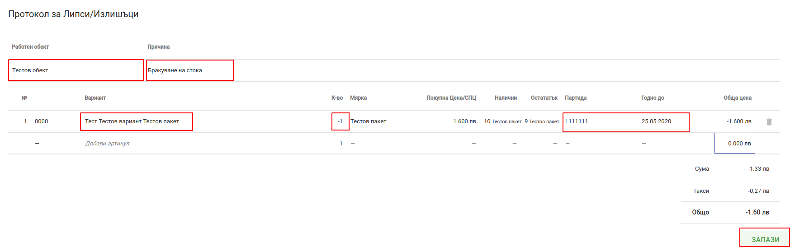
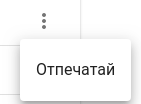
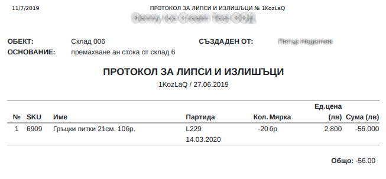

# Липси/Излишъци

Политис предоставя възможност за извършване на инвентаризации и корекции на складовете чрез липси и излишъци. Достъп до фунционалностите свързани с корекции на складове се осъществява като от главното меню се избере *Стоков контрол* и след това таб *Липси / Излишъци*

На екрана се визуализира списък с всички съдадени пипси и излишъци. Списъка има опция за филтриране  по склад.

<split-panel>
  <panel>
    Hова корекция се извършва чрез бутона в долната част на екрана.
  </panel>
  <panel>
    
  </panel>
</split-panel>

 

При натискане на бутона на екрана се зарежда форма за нов *Протокол за липси и излишъци*.

Формата предоставя следните полета:

* **Работен обект** - складът, за който ще се прави корекция.
* **Причина** - причината поради която се прави корекцията.
* **Вариант** - продукта, за който се прави корекция
* **Количество** - трябва да се зададе, **положителна стойност при излишък** или **отрицателна при липса**.
* **Партида** - трябва да се отбележи партидата и срока на годност;

След попълване на всички необходими полета се натиска бутон *Запази*

<split-panel>
  <panel>
    За всяка корекция може да се отпечата <i>Протокол за липси и излишъци</i>. За целта от контекстното меню се избира <i>Отпечатай</i> за всеки ред от  списъка с липси и излишъци.
  </panel>
  <panel>
    
  </panel>
</split-panel>

 

